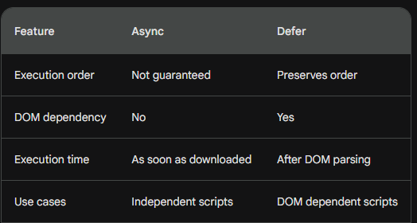

# HTML - Complete Interview Guide

## HTML Fundamentals

### 1. What is HTML?

HTML (HyperText Markup Language) is the standard markup language for creating web pages. It describes the structure and content of a webpage using elements and tags.

**Key Points:**
- HTML is not a programming language; it's a markup language
- Uses tags to define elements: `<tagname>content</tagname>`
- Current version: HTML5
- Works with CSS (styling) and JavaScript (behavior)

**Basic HTML Example:**
```html
<!DOCTYPE html>
<html lang="en">
<head>
  <meta charset="UTF-8">
  <title>My First Page</title>
</head>
<body>
  <h1>Hello World!</h1>
  <p>This is a paragraph.</p>
</body>
</html>
```


### 2. What is DOCTYPE?

`<!DOCTYPE html>` is a declaration that tells the browser which version of HTML the page is written in. It must be the very first line in an HTML document.

**Purpose:**
- Ensures the browser renders the page in standards mode (not quirks mode)
- Prevents rendering inconsistencies across browsers
- Required for HTML5 validation

**HTML5 DOCTYPE (simplified):**
```html
<!DOCTYPE html>
```

**Old HTML4 DOCTYPE (complex):**
```html
<!DOCTYPE HTML PUBLIC "-//W3C//DTD HTML 4.01//EN" "http://www.w3.org/TR/html4/strict.dtd">
```


### 3. What is the difference between Block and Inline elements?

**Block Elements:**
- Take up full width available
- Start on a new line
- Can contain other block and inline elements
- Examples: `<div>`, `<p>`, `<h1>-<h6>`, `<ul>`, `<ol>`, `<section>`, `<article>`

```html
<div>This is a block element</div>
<p>This starts on a new line</p>
```

**Inline Elements:**
- Take up only as much width as necessary
- Do not start on a new line
- Cannot contain block elements (usually)
- Examples: `<span>`, `<a>`, `<strong>`, `<em>`, ``, `<input>`

```html
<span>Inline</span> <a href="#">Link</a> <strong>Bold</strong>
```

**CSS Display Property:**
```css
/* Convert block to inline */
div { display: inline; }

/* Convert inline to block */
span { display: block; }

/* Inline-block (best of both) */
span { display: inline-block; }
```


### 4. What are HTML Attributes?

Attributes provide additional information about HTML elements. They are always specified in the opening tag.

**Common Attributes:**

```html
<!-- id - unique identifier -->
<div id="header">Header</div>

<!-- class - for styling/grouping -->
<p class="text-large highlight">Text</p>

<!-- href - link destination -->
<a href="https://example.com">Link</a>

<!-- src - source for images/scripts -->


<!-- alt - alternative text for images -->


<!-- title - tooltip text -->
<p title="This is a tooltip">Hover over me</p>

<!-- style - inline CSS -->
<p style="color: red;">Red text</p>

<!-- data-* - custom data attributes -->
<div data-user-id="123" data-role="admin">User</div>

<!-- disabled - disable form elements -->
<button disabled>Can't click</button>

<!-- required - required form field -->
<input type="text" required>

<!-- placeholder - hint text -->
<input type="email" placeholder="Enter email">

<!-- target - where to open link -->
<a href="page.html" target="_blank">Open in new tab</a>
```


### 5. What are the different types of Lists in HTML?

**Ordered List (numbered):**
```html
<ol>
  <li>First item</li>
  <li>Second item</li>
  <li>Third item</li>
</ol>

<!-- Custom numbering -->
<ol type="A">  <!-- A, B, C -->
<ol type="I">  <!-- I, II, III -->
<ol start="5"> <!-- Start from 5 -->
```

**Unordered List (bullets):**
```html
<ul>
  <li>Item one</li>
  <li>Item two</li>
  <li>Item three</li>
</ul>
```

**Description List:**
```html
<dl>
  <dt>HTML</dt>
  <dd>HyperText Markup Language</dd>
  
  <dt>CSS</dt>
  <dd>Cascading Style Sheets</dd>
</dl>
```

**Nested Lists:**
```html
<ul>
  <li>Item 1
    <ul>
      <li>Sub-item 1.1</li>
      <li>Sub-item 1.2</li>
    </ul>
  </li>
  <li>Item 2</li>
</ul>
```


### 6. How do you create Tables in HTML?

```html
<table>
  <thead>
    <tr>
      <th>Name</th>
      <th>Age</th>
      <th>City</th>
    </tr>
  </thead>
  <tbody>
    <tr>
      <td>Alice</td>
      <td>25</td>
      <td>NYC</td>
    </tr>
    <tr>
      <td>Bob</td>
      <td>30</td>
      <td>LA</td>
    </tr>
  </tbody>
  <tfoot>
    <tr>
      <td colspan="3">Total: 2 people</td>
    </tr>
  </tfoot>
</table>
```

**Table Attributes:**
```html
<!-- Colspan - span multiple columns -->
<td colspan="2">Spans 2 columns</td>

<!-- Rowspan - span multiple rows -->
<td rowspan="3">Spans 3 rows</td>

<!-- Scope - for accessibility -->
<th scope="col">Column Header</th>
<th scope="row">Row Header</th>
```


### 7. What are the different Form elements and Input types?

**Basic Form:**
```html
<form action="/submit" method="POST">
  <!-- Text input -->
  <label for="name">Name:</label>
  <input type="text" id="name" name="name" required>
  
  <!-- Email input -->
  <label for="email">Email:</label>
  <input type="email" id="email" name="email" required>
  
  <!-- Password input -->
  <label for="password">Password:</label>
  <input type="password" id="password" name="password" minlength="8">
  
  <!-- Number input -->
  <label for="age">Age:</label>
  <input type="number" id="age" name="age" min="0" max="120">
  
  <!-- Date input -->
  <label for="birthdate">Birthdate:</label>
  <input type="date" id="birthdate" name="birthdate">
  
  <!-- Checkbox -->
  <input type="checkbox" id="subscribe" name="subscribe">
  <label for="subscribe">Subscribe to newsletter</label>
  
  <!-- Radio buttons -->
  <input type="radio" id="male" name="gender" value="male">
  <label for="male">Male</label>
  <input type="radio" id="female" name="gender" value="female">
  <label for="female">Female</label>
  
  <!-- Select dropdown -->
  <label for="country">Country:</label>
  <select id="country" name="country">
    <option value="">Select...</option>
    <option value="us">United States</option>
    <option value="uk">United Kingdom</option>
  </select>
  
  <!-- Textarea -->
  <label for="message">Message:</label>
  <textarea id="message" name="message" rows="4"></textarea>
  
  <!-- File upload -->
  <label for="file">Upload:</label>
  <input type="file" id="file" name="file" accept=".pdf,.jpg">
  
  <!-- Submit button -->
  <button type="submit">Submit</button>
  <button type="reset">Reset</button>
</form>
```

**HTML5 Input Types:**
```html
<input type="color">      <!-- Color picker -->
<input type="range">      <!-- Slider -->
<input type="tel">        <!-- Telephone -->
<input type="url">        <!-- URL -->
<input type="search">     <!-- Search box -->
<input type="time">       <!-- Time picker -->
<input type="datetime-local"> <!-- Date and time -->
<input type="month">      <!-- Month picker -->
<input type="week">       <!-- Week picker -->
```


### 8. What is the difference between `<head>` and `<body>`?

**`<head>` Element:**
- Contains metadata about the document
- Not displayed on the page
- Includes: title, meta tags, links to CSS, scripts

```html
<head>
  <meta charset="UTF-8">
  <meta name="viewport" content="width=device-width, initial-scale=1.0">
  <title>Page Title</title>
  <link rel="stylesheet" href="styles.css">
  <script src="script.js"></script>
</head>
```

**`<body>` Element:**
- Contains all visible content
- Everything users see and interact with
- Includes: text, images, links, forms, etc.

```html
<body>
  <header>
    <h1>Welcome</h1>
  </header>
  <main>
    <p>Content goes here</p>
  </main>
  <footer>
    <p>&copy; 2024</p>
  </footer>
</body>
```


### 9. What are HTML Entities?

HTML entities are special characters that are reserved in HTML or not available on keyboards.

**Common Entities:**
```html
&lt;      <!-- < (less than) -->
&gt;      <!-- > (greater than) -->
&amp;     <!-- & (ampersand) -->
&quot;    <!-- " (quotation mark) -->
&apos;    <!-- ' (apostrophe) -->
&nbsp;    <!-- Non-breaking space -->
&copy;    <!-- © (copyright) -->
&reg;     <!-- ® (registered) -->
&trade;   <!-- ™ (trademark) -->
&euro;    <!-- € (euro) -->
&pound;   <!-- £ (pound) -->
```

**Example:**
```html
<p>Use &lt;p&gt; tags for paragraphs</p>
<!-- Displays: Use <p> tags for paragraphs -->

<p>Price: &euro;100 &amp; free shipping</p>
<!-- Displays: Price: €100 & free shipping -->
```


### 10. What are Links and Anchor tags?

```html
<!-- Basic link -->
<a href="https://example.com">Visit Example</a>

<!-- Open in new tab -->
<a href="page.html" target="_blank">New Tab</a>

<!-- Email link -->
<a href="mailto:email@example.com">Send Email</a>

<!-- Phone link -->
<a href="tel:+1234567890">Call Us</a>

<!-- Download link -->
<a href="file.pdf" download>Download PDF</a>

<!-- Jump to section (anchor) -->
<a href="#section1">Go to Section 1</a>
<div id="section1">Section 1 Content</div>

<!-- Relative vs Absolute URLs -->
<a href="/about">Relative URL</a>
<a href="https://example.com/about">Absolute URL</a>

<!-- Link with title (tooltip) -->
<a href="page.html" title="Click to learn more">Learn More</a>
```

**Target Attribute Values:**
- `_blank` - Opens in new tab/window
- `_self` - Opens in same frame (default)
- `_parent` - Opens in parent frame
- `_top` - Opens in full window


### 11. What is Accessibility in HTML?

Accessibility ensures websites are usable by people with disabilities.

**ARIA (Accessible Rich Internet Applications):**
```html
<!-- ARIA roles -->
<nav role="navigation">
  <ul>
    <li><a href="/">Home</a></li>
  </ul>
</nav>

<!-- ARIA labels -->
<button aria-label="Close dialog">X</button>

<!-- ARIA states -->
<button aria-pressed="true">Toggle</button>
<div aria-hidden="true">Hidden from screen readers</div>
<input aria-required="true" aria-invalid="false">

<!-- ARIA live regions -->
<div aria-live="polite">Status updates</div>
```

**Accessibility Best Practices:**
```html
<!-- Always use alt text for images -->


<!-- Use semantic HTML -->
<header>, <nav>, <main>, <article>, <aside>, <footer>

<!-- Label form inputs -->
<label for="email">Email:</label>
<input type="email" id="email" name="email">

<!-- Use proper heading hierarchy -->
<h1>Main Title</h1>
  <h2>Subtitle</h2>
    <h3>Section</h3>

<!-- Keyboard navigation -->
<button tabindex="0">Clickable</button>

<!-- Skip to main content link -->
<a href="#main-content" class="skip-link">Skip to main content</a>
<main id="main-content">...</main>

<!-- Language attribute -->
<html lang="en">
```


### 12. What are iframes and when should you use them?

An iframe (inline frame) embeds another HTML document within the current page.

```html
<!-- Basic iframe -->
<iframe src="https://example.com" width="600" height="400"></iframe>

<!-- YouTube embed -->
<iframe 
  width="560" 
  height="315" 
  src="https://www.youtube.com/embed/VIDEO_ID"
  frameborder="0"
  allow="accelerometer; autoplay; encrypted-media; gyroscope"
  allowfullscreen>
</iframe>

<!-- Google Maps embed -->
<iframe 
  src="https://www.google.com/maps/embed?pb=..."
  width="600" 
  height="450" 
  style="border:0;"
  loading="lazy">
</iframe>

<!-- Sandbox attribute for security -->
<iframe 
  src="untrusted.html" 
  sandbox="allow-scripts allow-same-origin">
</iframe>
```

**When to use iframes:**
- Embedding third-party content (videos, maps)
- Displaying ads
- Embedding widgets

**Security Concerns:**
- Use `sandbox` attribute
- Set `Content-Security-Policy` headers
- Avoid embedding untrusted content


### 13. What is Image Optimization in HTML?

**Lazy Loading:**
```html
<!-- Native lazy loading -->

```

**Responsive Images:**
```html
<!-- srcset for different resolutions -->


<!-- Picture element for different formats -->
<picture>
  <source srcset="image.webp" type="image/webp">
  <source srcset="image.jpg" type="image/jpeg">
  
</picture>
```

**Image Formats:**
- **JPEG** - Photos, complex images
- **PNG** - Transparency, logos
- **WebP** - Modern format, smaller size
- **SVG** - Vector graphics, icons
- **GIF** - Simple animations


### 14. What is SEO and HTML best practices?

**SEO (Search Engine Optimization)** improves website visibility in search engines.

**HTML SEO Best Practices:**
```html
<!-- Descriptive title (50-60 characters) -->
<title>Best Pizza in NYC | Joe's Pizza</title>

<!-- Meta description (150-160 characters) -->
<meta name="description" content="Joe's Pizza serves the best New York style pizza since 1975. Order online for delivery.">

<!-- Meta keywords (less important now) -->
<meta name="keywords" content="pizza, NYC, delivery, Italian food">

<!-- Open Graph for social media -->
<meta property="og:title" content="Joe's Pizza">
<meta property="og:description" content="Best pizza in NYC">
<meta property="og:image" content="https://example.com/pizza.jpg">
<meta property="og:url" content="https://example.com">

<!-- Canonical URL -->
<link rel="canonical" href="https://example.com/page">

<!-- Structured data (Schema.org) -->
<script type="application/ld+json">
{
  "@context": "https://schema.org",
  "@type": "Restaurant",
  "name": "Joe's Pizza",
  "address": {
    "@type": "PostalAddress",
    "streetAddress": "123 Main St",
    "addressLocality": "New York",
    "addressRegion": "NY"
  }
}
</script>

<!-- Semantic HTML -->
<header>
  <h1>Main Heading (only one per page)</h1>
</header>
<nav>Navigation</nav>
<main>
  <article>
    <h2>Article Title</h2>
  </article>
</main>
<footer>Footer</footer>

<!-- Descriptive alt text -->


<!-- Clean URLs -->
<!-- Good: /products/pizza -->
<!-- Bad: /page.php?id=123&cat=food -->
```


### 15. Where should you place Script tags?

**Best Practices:**

```html
<!DOCTYPE html>
<html>
<head>
  <!-- Critical CSS only -->
  <style>/* Critical styles */</style>
  
  <!-- Async scripts (analytics, ads) -->
  <script async src="analytics.js"></script>
  
  <!-- Defer scripts (DOM manipulation) -->
  <script defer src="app.js"></script>
</head>
<body>
  <!-- Content -->
  
  <!-- Scripts at end of body (old method) -->
  <script src="script.js"></script>
</body>
</html>
```

**Placement Options:**
1. **`<head>` with `defer`** - Best for most scripts
2. **`<head>` with `async`** - For independent scripts
3. **End of `<body>`** - Legacy approach
4. **Inline in `<head>`** - Only for critical scripts


## HTML5 Features

### 1. HTML 5 features (The latest version of HTML is HTML5.) link to refer: https://www.browserstack.com/guide/top-html5-features

- a. Semantic Elements : 
	· Semantics, to put it simply, is the use of HTML tags that accurately reflect the content they contain. For instance, using the <div> tag doesn’t suggest the content it will carry, however using the <p> tag suggests it can be used to hold paragraph information.  For example : <header> , <article> : define an independent, self-contained piece of content.
	· Why to use ? 
	- Accessibility: It is easier for persons with disabilities to navigate your website if you have appropriately laid up a foundation of semantic HTML.
		- SEO (Search engine optimization) :  Search engines utilize HTML to decipher the content, its placement of semantic keywords has an impact on the webpage’s ranking.
		- Browser compatibility: Each browser interacts with semantic elements differently, semantic elements make it simple to utilize larger coverage of your website across platforms.

### 2. Audio and Video Support :
- To embed Audio and Video into your HTML document, you may use the following two tags, <audio> and <video> tags. 
- Example : 
	 ```<video width = "300" height = "200" controls autoplay>
	<source src = "./dog.mp4" type ="video/mp4" />
	</video>
	 
	<audio controls>
	<source src="dog.mp3" type="audio/mp3">
	</audio>```
					 
### 3. Canvas Elements :
				Canvas Elements is a top-notch feature that has made the tedious task of handling graphics easier for developers.
				Example : 
				<canvas id="Canvas" width="200" height="100" style="border:1px solid #000000;">Canvas</canvas>
				 
### 4. Geolocation API :
	The Geolocation API is an HTML feature that is used access the geographical position of a user, however, it is not accessed unless the user approves of it.
	 
### 5. Local Storage :
	Using this feature you can reduce the transactions between the application and the backend server, creating a fast application. However, there are some limitations, such as there is limited storage, and you can not access more storage than that. 
	 
### 6. Responsive Images :
    Including srcset attribute to specify multiple versions of an image at different screen resolutions. 
	There’s one more attribute, the sizes attribute which is used to specify how much space the image will take up on the page, it also helps the browser to pick the best-suited image depending upon the screen size it is viewed upon.
	
				 
### 7. Web Workers :
	Using web workers, you can transfer some processes from the Main thread to the Worker thread. This will free up the main thread for other tasks while the worker thread does the CPU-intensive tasks.
	Refer https://www.knowledgehut.com/blog/web-development/turbocharge-web-apps-with-web-workers for more details.
· Example :
	const worker = new Worker(worker.js);  
	// Sending and Receiving a message from the main script to the worker script: main.js 
	btn1.addEventListner('click', (event)=>{ 
    // Using the postMessage to send Message from the main.js to worker.js
    worker.postMessage('Hello Worker'); 
	 }); 
	worker.onmessage = function(message) alert(`The sum is: ${message.data}`); 
				 
### 8. Drag and Drop API : 
	Drag and drop is among the most unique features of HTML5 that allow you to grab any element in the DOM and drop it to a different location. To create an element able to drag and drop, set the attribute “draggable” on the tag and put its value to true.  
	· Example : <p id="drag" draggable="true">Draggable element</p>
		 
### 9. Form Enhancements :
	 key enhancements in the new HTML 5 include new input times such as email, URL, and more, placeholder text, required fields feature, validation, and more. 
	 
### 10. Web Sockets:
	In the previous versions of HTML, when a client sends a request to the backend server, the server then responds afterward. However, in HTML 5 we can establish a bidirectional live communication between the server and the client (a web browser) to reduce the latency in the responses. 
	 
### 11. Micro Data :
	Micro Data in simpler words is a further deeper level to provide semantics to your webpage. This feature is used to structure data in HTML documents by embedding your own customized elements. 
· Example : link -> https://developer.mozilla.org/en-US/docs/Web/HTML/Global_attributes/itemref
	There are five global attributes:  itemref, itemmid, itemscope, itemprop, and itemtype 
	 
### 12. Cross Document Messaging
	There are several scenarios, in which you want to access cross-document communication to make your web page more interactive with less effort. 
	Some of these scenarios are when you want to embed data from third-party sites such as maps, photos, videos, and more. This can be achieved in HTML 5 with the feature of cross-document messaging, to enable real-time communication between different parts of websites opened in different frames, windows, etc. 
	Link : https://html.spec.whatwg.org/multipage/web-messaging.html

			 
### 13. Meta Tag :
	The <meta> tag defines metadata about an HTML document. Metadata is (information) about data.
	<meta> tags always go inside the <head> element, and are typically used to specify character set, page description, keywords, author of the document, and viewport settings.
	Metadata will not be displayed on the page, but is machine parsable.
	 
	<head>
	  <meta charset="UTF-8">
	  <meta name="description" content="Free Web tutorials">
	  <meta name="keywords" content="HTML, CSS, JavaScript">
	  <meta name="author" content="John Doe">
	  <meta name="viewport" content="width=device-width, initial-scale=1.0">
	</head>

### 14. Document Structure

```
<!DOCTYPE html> <!-- Document type declaration -->
<html lang="en"> <!--root element with language -->
<head> <!-- This element contains metadata about the document-->
  <meta charset="UTF-8">
  <meta name="viewport" content="width=device-width, initial-scale=1.0">
  <title>Async and Defer Example</title>
  
  <!-- Script tags go here -->
  <script async src="async-script.js"></script>
  <script defer src="deferred-script.js"></script>
</head>
<body> <!-- visible content -->
  <h1>Async and Defer Example</h1>

  <!-- Inline script tag -->
  <script>
    console.log('Inline script');
  </script>

  <!-- Regular script tag -->
  <script src="regular-script.js"></script>
</body>
</html>
```
### 15. Difference between defer and async
- Defer :
    - Ordered execution: Scripts are executed in the order they appear in the HTML, but only after the HTML parsing is complete.
    - Waits for DOM: Ensures the DOM is fully built before executing the script, making it suitable for scripts that rely on DOM elements or interact with the page structure.
    - Use defer for scripts that rely on the DOM or need to run in a specific order.

- Async :
    - <b>The async attribute is used to load the script asynchronously, meaning the script will be downloaded in parallel with parsing the HTML document, and executed as soon as it's available, without blocking the HTML parsing.</b>
    - Script execution is independent: Once downloaded, the script is executed as soon as possible, regardless of where the browser is in parsing the HTML or the order of other scripts.
    - No guaranteed order: Multiple async scripts can execute concurrently or in any order they finish downloading.
    - Use async for independent scripts that don't interact with the DOM or other scripts (e.g., analytics trackers).

    
```<!DOCTYPE html>
<html>
<head>
  <title>Async and Defer Example</title>
  <!-- This script will be loaded asynchronously -->
  <script async src="async-script.js"></script>

  <!-- This script will be loaded asynchronously and executed after HTML parsing -->
  <script defer src="deferred-script.js"></script>
</head>
<body>
  <h1>Async and Defer Example</h1>

  <!-- This script will be loaded and executed in the order it appears -->
  <script>
    console.log('Inline script');
  </script>
</body>
</html>```

       