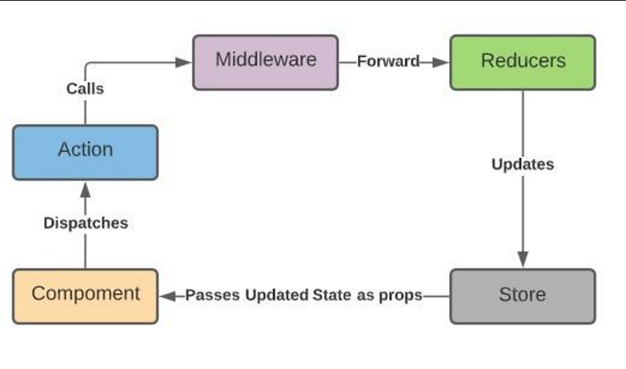

### Redux architecture
refer react-redux folder for code
```
+-------------------+
|      React        |
|    Component      |
+-------------------+
           |
           | 4. Subscribe to State Changes
           |
+-------------------+
|       Redux       |
|      Store        |
+-------------------+
     |        ^
     |        |
     | 3. Get  | 5. State
     |  State  |  Update
     |        |
     v        |
+-------------------+
|     Reducers      |
+-------------------+
     ^        |
     |        |
     | 2. Call | 6. New
     |  with   |  State
     | Action  |
     |        |
     v        |
+-------------------+
|    Action         |
|    Creators       |
+-------------------+
     ^        |
     |        |
     | 1. Call | 7. Return
     |        |  Action
     |        |
     v        |
+-------------------+
|      React        |
|    Component      |
+-------------------+
```


### Differences between redux-saga and redux-thunk?
- Both Redux Thunk and Redux Saga take care of dealing with side effects. 
- In most of the scenarios, Thunk uses Promises to deal with them, whereas Saga uses Generators. Thunk is simple to use and Promises are familiar to many developers, Sagas/Generators are more powerful but you will need to learn them.


### “Should I use Context or should I use Redux?”

 Context itself is not a state management system.

It’s a dependency injection mechanism, and you can put whatever value you want in Context, and most often you are the one managing that state in a React component, with the useState hook or the useReducer hook. And you’re the one deciding where the state lives, handling how to update it, and then putting the value into Context for distribution.

So yeah, useReducer plus useContext together kind of make up a state management system. And that one is more equivalent to what Redux does with React, but Context by itself is not a state management system.
   - Actions
     An action is a plain JavaScript object that has a type field. You can think of an action as an event that describes something that happened in the application. 
   - Action Creators
     An action creator is a function that creates and returns an action object. We typically use these so we don't have to write the action object by hand every time
   - Reducers
     A reducer is a function that receives the current state and an action object, decides how to update the state if necessary, and returns the new state: (state, action) => newState. You can think of a reducer as an event listener which handles events based on the received action (event) type.
